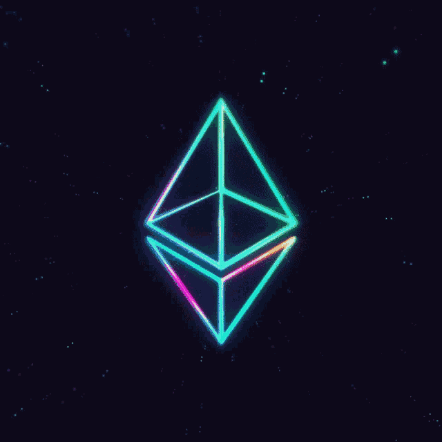

# Cryptocurrency

 

  

 

_Crypto (short for cryptocurrency) is a new form of digital money powered by cryptography._

_It all started in 2008 with Bitcoin. You could use it to send funds to anyone anywhere globally. What made crypto different from normal bank transfers or other financial services like Paypal or Alipay is that there was no middle man for the first time._

_Wait, what is a middle man?_

_A middle-man is a central authority like a bank or government that intervenes in a transaction between the sender and recipient. They have the power to surveill, censor or revert transactions and they can share the sensitive data they collect about you with third parties. They also often dictate which financial services you have access to._

_Things are different with crypto. Transactions directly connect sender and recipient without having to deal with any central authority. Nobody else will have access to your funds and nobody can tell you what services you can use. This is possible because of the blockchain technology upon which cryptocurrencies operate._

**Blockchains use cryptographic techniques to ensure that your funds are safe. Similar techniques have been used in the banking industries to ensure the security of monetary transactions for years. So you could say cryptocurrencies have a bank level of security.**

 

## Types Of Cryptocurrency Protocols

### 1. Bitcoin

_Bitcoin uses peer-to-peer technology to operate with no central authority or banks; managing transactions and the issuing of bitcoins is carried out collectively by the network. Bitcoin is open-source; its design is public, nobody owns or controls Bitcoin and everyone can take part. Through many of its unique properties, Bitcoin allows exciting uses that could not be covered by any previous payment system._

**API-reference:** https://bitcoin.org/en/how-it-works

### 2. Ethereum

_Launched in 2015, Ethereum builds on Bitcoin's innovation, with some big differences._

_Both let you use digital money without payment providers or banks. But Ethereum is programmable, so you can also build and deploy decentralized applications on its network._

_Ethereum being programmable means that you can build apps that use the blockchain to store data or control what your app can do. This results in a general purpose blockchain that can be programmed to do anything. As there is no limit to what Ethereum can do, it allows for great innovation to happen on the Ethereum network._

_While Bitcoin is only a payment network, Ethereum is more like a marketplace of financial services, games, social networks and other apps that respect your privacy and cannot censor you._

**API-reference:** https://ethereum.org/en/what-is-ethereum/

 

## What is Mempools?

_Transactions are not added to a blockchain as soon as you make a payment. They are first sent to peer nodes for verification. Each node verifies the cryptographic signatures, checks if the funds are available, etc. Once the checks are done, the transaction is again broadcasted to nearby nodes. The goal is to send the transaction data to as many nodes as possible. This can help the nodes reach a consensus regarding the validity of a transaction.
If the transaction is invalid, then a node would simply drop it. This can happen if the sender has an insufficient balance in their wallet or the recipient’s public key is invalid. On the other hand, if a node is able to deem that a transaction as valid, it will be moved to the mempool, where a mining node can pick it up and package it into a block._

**Mempools are of advantage for both miners and users. They help miners pick up transactions based on priority, which can be helpful when there is a lot of traffic on the network. Miners can also download the current “transaction waiting list” to start confirming transactions. For users and the network, mempools provide resistance against DDoS attacks. These attacks occur when bad actors flood the network with minuscule transactions to create unmanageable congestion.**

 

## Application-Specific Integrated Circuit (ASIC) Miner

 

 

_An application-specific integrated circuit (ASIC) is an integrated circuit chip designed for a specific purpose. An ASIC miner is a computerized device that uses ASICs for the sole purpose of "mining" digital currency. Generally, each ASIC miner is constructed to mine a specific digital currency. So, a Bitcoin ASIC miner can mine only bitcoin. One way to think about bitcoin ASICs is as specialized bitcoin mining computers optimized to solve the mining algorithm._

 

## Orphaned Blocks

_In blockchain terms, orphan blocks are blocks mined simultaneously as another block but not accepted by the blockchain. Most of the time, this is because there are not enough blocks generated from that block for the network to recognize it as the longest fork. The Bitcoin blockchain discards orphan blocks; however, other blockchains may use them for different purposes._

_Technically, orphan blocks are called stale blocks, but because most people refer to them as orphans or uncles, the name orphan (and uncle) block has stuck._

- An orphan block is a block that has been solved within the blockchain network but was not accepted by the network.

- There can be two miners who solve valid blocks simultaneously. The network uses both blocks until one chain has more verified blocks. Then, the blocks in the shorter chain are orphaned.

- Orphan blocks are a regular occurrence in a distributed blockchain such as Bitcoin.
